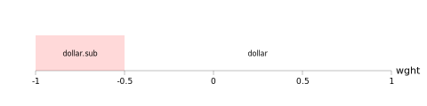

(The July 21st version of this document presented the wght/opsz example with the
opsz axis in the opposite direction. This version reverses the direction of that
axis by changing the labels, so that the example reflects how the two axes are
actually used.)

# Introduction

This is a quick discussion of two potential problems with the current OpenType
condition set specification, along with possible solutions. The first relates
to performance and subtable sizes when the total number of condition sets used
across multiple GSUB or GPOS features gets large. The second has to do with a
relevant case that isn't handled.  I start with some background on single-table
condition cases.

# Background: The single feature case

If you have one relevant axis and one substitution, things are very simple.
For example you want to use `rvrn` to substitute a double-slash dollar sign at
normalized `wght` -.5, with a single-slash dollar sign used elsewhere, you'll
wind up with one feature variation record using the single condition -1 <=
`wght` <= -0.5 to override the default feature subtable containing the
single-slash dollar sign.

{ width=90% }
\ 

Add additional substitutions, all still on a single relevant axis, and things
stay simple: the number of FeatureVariation records needed is the number of
substitutions needed. So if the `cent` glyph needs a substitution at `wght` 0
and the `euro` glyph needs one at `wght` 0.5, you just need three
FeatureVariation records in addition to the base feature subtable. Each new
substitution adds a new region.

{ width=90% }
\ 

Things get messier with two axes. Assume a second axis `foo` with these three
substitutions: dollar at `wght` -.5, `foo` .5; cent at `wght` 0, `foo` 0; and
euro at `wght` .5, `foo` -.5.  These add 6 regions in addition to the feature
table, for a total of seven combinations. (This would be worse if there was
more than one substitution point per axis.)

{ width=90% }
\ 

Broadly speaking there are two ways of encoding these regions. One might be
called "geometric", in which each region is distinct. This involves more
conditons but smaller condition sets.

\footnotesize
```
   1)  -1    <= wght <=  -0.5 , -1    <= foo <= -0.5 : dollar.sub , cent.sub , euro.sub
   2)  -0.5+ <= wght <=   0   , -1    <= foo <= -0.5 : dollar     , cent.sub , euro.sub
   3)  -1    <= wght <= -.5   , -0.5+ <= foo <=  0   : dollar.sub , cent.sub , euro
   4)  -0.5+ <= wght <=   0   , -0.5+ <= foo <=  0:  : dollar     , cent.sub , euro
   5)   0+   <= wght <=   0.5 , -1    <= foo <= -0.5 : dollar     , cent     , euro.sub
   6)  -1    <= wght <=  -0.5 ,  0+   <= foo <=  0.5 : dollar.sub , cent     , euro

   Default: dollar, cent, euro
```
\normalsize

The other might be called "logical". This involves fewer conditions but larger
condition sets.

\footnotesize
```
    D => -1 <= wght <= -0.5 & -1 <= foo <=  0.5
    C => -1 <= wght <=  0   & -1 <= foo <=  0
    E => -1 <= wght <=  0.5 & -1 <= foo <= -0.5

    1)  D & C & E : dollar.sub , cent.sub , euro.sub
    2)  C & E     : dollar     , cent.sub , euro.sub
    3)  E         : dollar     , cent     , euro.sub
    4)  D & C     : dollar.sub , cent.sub , euro
    5)  C         : dollar     , cent.sub , euro
    6)  D         : dollar.sub , cent     , euro

    Default: dollar, cent, euro
```
\normalsize

The logical approach works because the search through feature variation records
stops the full condition set is met. This means the list can start with a
conjunction of all glyph-specific regions and then followed by less and less
specific conjunctions.  In effect, the more specific conjunctions earlier in
the list mask regions of the less specific, later entries.

This need to specify each region one way or another is an inherent part of the
feature variations mechanism. It may put practical limits on the number of
separate substitutions in a given feature, but avoiding that problem would
require an entirely different approach.

# Problem one: Feature interdependence with substitution

Now suppose that you have a feature with three substitutions on one axis, as
well as a different feature with three entirely unrelated substitutions on a
different axis.  For example, dollar changes at `wght` -.5, cent at `wght` 0,
and euro at `wght` .5, while one changes at `foo` -.5, two at `foo` 0, and
three at `foo` .5.

Although these substitutions do not seem to be related in the abstract, and
will probably not appear to be related when encoded in a feature file, the
feature compiler must treat them as related when building the GSUB feature
variation subtable in its present form.  This is because there is only one
unified list of feature variation records per table (GSUB or GPOS). So the
above pattern of substitution will not result in 6 regions plus the default (3
for `wght`, 3 for `foo`), but 15.

{ width=90% }
\ 

With a logical encoding those would be (with redundant conditions omitted):

\footnotesize
```
    D => -1 <= wght <= -0.5 
    C => -1 <= wght <=  0
    E => -1 <= wght <=  0.5
    1 => -1 <= foo  <= -0.5
    2 => -1 <= foo  <=  0
    3 => -1 <= foo  <=  0.5

     1)  D & 1 : dollar.sub , cent.sub , euro.sub , one.sub , two.sub , three.sub
     2)  C & 1 : dollar     , cent.sub , euro.sub , one.sub , two.sub , three.sub
     3)  E & 1 : dollar     , cent     , euro.sub , one.sub , two.sub , three.sub
     4)      1 : dollar     , cent     , euro     , one.sub , two.sub , three.sub
     5)  D & 2 : dollar.sub , cent.sub , euro.sub , one     , two.sub , three.sub
     6)  C & 2 : dollar     , cent.sub , euro.sub , one     , two.sub , three.sub
     7)  E & 2 : dollar     , cent     , euro.sub , one     , two.sub , three.sub
     8)      2 : dollar     , cent     , euro     , one     , two.sub , three.sub
     9)  D & 3 : dollar.sub , cent.sub , euro.sub , one     , two     , three.sub
    10)  C & 3 : dollar     , cent.sub , euro.sub , one     , two     , three.sub
    11)  E & 3 : dollar     , cent     , euro.sub , one     , two     , three.sub
    12)      3 : dollar     , cent     , euro     , one     , two     , three.sub
    13)  D     : dollar.sub , cent.sub , euro.sub , one     , two     , three    
    14)  C     : dollar     , cent.sub , euro.sub , one     , two     , three    
    15)  E     : dollar     , cent     , euro.sub , one     , two     , three    

    def   : dollar     , cent     , euro     , one     , two     , three    
```
\normalsize

More generally, this means that whatever features use this table, the compiler
must carve up the geometry across all of them. Therefore the scaling problem is
just not within a feature but across all features.

This seems like a flaw in the current specification, especially because it is
*not* an inherent part of the mechanism. I'll suggest one approach to fixing it
below. However, some people might wonder whether we'll ever see more than a few
regions in practice. With that in mind, let's move on to problem two.

# Problem two: Substitutions with interdependent axes

Consider the archetypal case of substitution: A variable font has two glyphs
for the dollar sign, one with two vertical strokes and another with just one
stroke. The designer wants to switch between the glyphs when they judge that 
the strokes are too thick to leave room for each other. In the usual examples
this decision is tied to the `wgwt` axis.

However, the *thickness* of a stroke is not necessarily just a function of one
axis. Indeed, the `opsz` axis, which is registered and already used in some
variable fonts, also changes the thickness of strokes, with strokes getting
somewhat thinner as the axis increases. If a designer's decision about when to
substitute is based on thickness, their preference across both axes might
look something like this:

{ width=90% }
\ 

Unfortunately this is impossible to express *directly* with the currently
available mechanisms. The best you can do is a stepwise approximation, perhaps
something like this:

{ width=90% }
\ 

Therefore, even for what isn't all that good an approximation, we now have
eight regions plus a default just for one glyph across two axes. If a different
glyph needs similar treatment along a different line on the same combination of
axes, we can use the same regimentation but will then wind up with 16 regions
plus a default. And so on.

Given that such a simple case requires a significant number of regions to
handle the substitution of a single glyph, I think we would be wise to fix at
least *one* of these problems.

# Proposed fix for interdependent axis substitution

I'm sure there are many novel means of addressing the interdependent axis
substitution problem, but it seems easiest to choose the *least* novel.  That
is, rather than having to invent a bunch of new machinery it seems preferable
to use something already available. And in this case the easiest option is to
use a normal interpolated value, just like those already used for point
locations in glyph outline data or kerning values in GPOS.

Accordingly, suppose that we were to add Condition Table Format 2: "Condition
Value":

\footnotesize
```
uint16    format                 Format = 2
int16     default                Value at default location
uint16    deltaSetOuterIndex     
uint16    deltaSetInnerIndex
```
\normalsize

This subtable specifies a varying 16 bit integer by way of its default and a
delta set selected with the Outer and Inner Indexes just as in a VariationIndex
table. This will be the first case in which an ItemVariationStore is referenced
from GSUB, but references in GPOS are already to the IVS in GDEF, so there is
little reason GSUB can't also make use of it.

The way this condition works is what you would expect: It evaluates to true
when the value is positive and false when it is 0 or negative. The font
engineer making use of the condition value is then responsible for placing the
"zero line" where the designer needs it. 

{ width=90% }
\ 

{ width=80% }
\ 

{ width=80% }
\ 

{ width=80% }
\ 

As a practical matter a condition value can't directly participate in the
geometric style of region partitioning discussed above. However, they work fine
with logical partitioning, and do so regardless of which system is being used
for other (format 1) conditions. (That is, you can still break down range-based
conditions geometrically and then mix those logically with a condition value as
needed.) Therefore, while some compilers might need a bit of adjustment it
should be possible to mix the two kinds of conditions as needed.

Some drafts of the avar 2 proposal note a need for a better condition
mechanism. I am not sure whether condition values can address all of that need.
However, I will note that while with traditional axes they can only define
straight lines in design space, with HOI they could presumably define curved
lines, so at least in broad strokes the mechanism appears to be "HOI ready".

# Proposed fix for feature interdependence

This is more of a sketch than a finished proposal, as there are a lot of ways
to modify the actual subtables, adjust the versions, etc. 

Conceptually, all that is needed to solve the problem is advance knowledge of
*which* features are encoded among the feature variation records.  This list
could be encoded by sorted tag in some new subtable.

Then, as the Feature Variation records are examined in order, instead of
stopping at the first match the search stops when a record corresponding to
each feature in the initial list is found. That way the entries for different
layout features can be interspersed without interfering with one another. If
the feature list is present you use the new search convention, if not you use
the old one.
