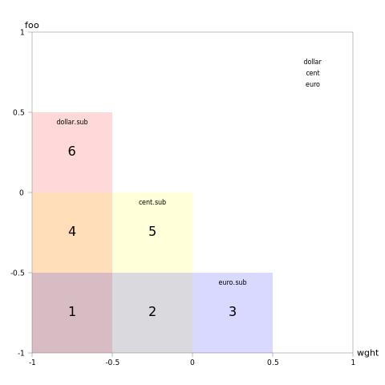
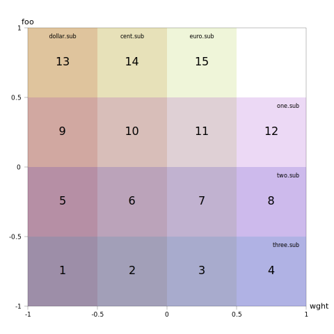

# Introduction

This document discusses a problem with the current feature variations
substitution mechanism in OpenType and outlines an alternative mechanism to
address it. The initial sketch of the new mechanism was developed by Behdad
Esfahbod and Skef Iterum in discussion on GitHub.

# Problem: Condition set permutations

With the current feature variations system things are simple when you have one
relevant axis and one substitution. For example you want to use `rvrn` to
substitute a double-slash dollar sign at normalized `wght` -.5, with a
single-slash dollar sign used elsewhere, you'll wind up with one feature
variation record using the single condition -1 <= `wght` <= -0.5 to override
the default feature subtable containing the single-slash dollar sign.

{ width=90% }
\ 

Add additional substitutions, all still on a single relevant axis, and things
stay simple: the number of FeatureVariation records needed is the number of
substitutions needed. So if the `cent` glyph needs a substitution at `wght` 0
and the `euro` glyph needs one at `wght` 0.5, you just need three
FeatureVariation records in addition to the base feature subtable. Each new
substitution adds a new region.

{ width=90% }
\ 

Things get messier with two axes. Assume a second axis `foo` with these three
substitutions: dollar at `wght` -.5, `foo` .5; cent at `wght` 0, `foo` 0; and
euro at `wght` .5, `foo` -.5.  These add 6 regions in addition to the feature
table, for a total of seven combinations. (This would be worse if there was
more than one substitution point per axis.)

{ width=90% }
\ 

Broadly speaking there are two ways of encoding these regions. One might be
called "geometric", in which each region is distinct. This involves more
conditions but smaller condition sets.

\footnotesize
```
   1)  -1    <= wght <=  -0.5 , -1    <= foo <= -0.5 : dollar.sub , cent.sub , euro.sub
   2)  -0.5+ <= wght <=   0   , -1    <= foo <= -0.5 : dollar     , cent.sub , euro.sub
   3)  -1    <= wght <= -.5   , -0.5+ <= foo <=  0   : dollar.sub , cent.sub , euro
   4)  -0.5+ <= wght <=   0   , -0.5+ <= foo <=  0:  : dollar     , cent.sub , euro
   5)   0+   <= wght <=   0.5 , -1    <= foo <= -0.5 : dollar     , cent     , euro.sub
   6)  -1    <= wght <=  -0.5 ,  0+   <= foo <=  0.5 : dollar.sub , cent     , euro

   Default: dollar, cent, euro
```
\normalsize

The other might be called "logical". This involves fewer conditions but larger
condition sets.

\footnotesize
```
    D => -1 <= wght <= -0.5 & -1 <= foo <=  0.5
    C => -1 <= wght <=  0   & -1 <= foo <=  0
    E => -1 <= wght <=  0.5 & -1 <= foo <= -0.5

    1)  D & C & E : dollar.sub , cent.sub , euro.sub
    2)  C & E     : dollar     , cent.sub , euro.sub
    3)  E         : dollar     , cent     , euro.sub
    4)  D & C     : dollar.sub , cent.sub , euro
    5)  C         : dollar     , cent.sub , euro
    6)  D         : dollar.sub , cent     , euro

    Default: dollar, cent, euro
```
\normalsize

The logical approach works because the search through feature variation records
stops at the first record where every condition in the set is true. This means
the list can start with a conjunction of all glyph-specific regions and then
followed by less and less specific conjunctions.  In effect, the more specific
conjunctions earlier in the list mask regions of the less specific, later
entries.

Note that because the mechanism is shared across all feature variations, the
problem is no better even when layout features are unrelated.  Suppose that you
have a feature with three substitutions on one axis, as well as a different
feature with three entirely unrelated substitutions on a different axis.  For
example, dollar changes at `wght` -.5, cent at `wght` 0, and euro at `wght` .5,
while one changes at `foo` -.5, two at `foo` 0, and three at `foo` .5.

Although these substitutions do not seem to be related in the abstract, and
will probably not appear to be related when encoded in a feature file, the
feature compiler must treat them as related when building the GSUB feature
variation subtable in its present form.  This is because there is only one
unified list of feature variation records per table (GSUB or GPOS). So the
above pattern of substitution will not result in 6 regions plus the default (3
for `wght`, 3 for `foo`), but 15.

{ width=90% }
\ 

With a logical encoding those would be (with redundant conditions omitted):

\footnotesize
```
    D => -1 <= wght <= -0.5 
    C => -1 <= wght <=  0
    E => -1 <= wght <=  0.5
    1 => -1 <= foo  <= -0.5
    2 => -1 <= foo  <=  0
    3 => -1 <= foo  <=  0.5

     1)  D & 1 : dollar.sub , cent.sub , euro.sub , one.sub , two.sub , three.sub
     2)  C & 1 : dollar     , cent.sub , euro.sub , one.sub , two.sub , three.sub
     3)  E & 1 : dollar     , cent     , euro.sub , one.sub , two.sub , three.sub
     4)      1 : dollar     , cent     , euro     , one.sub , two.sub , three.sub
     5)  D & 2 : dollar.sub , cent.sub , euro.sub , one     , two.sub , three.sub
     6)  C & 2 : dollar     , cent.sub , euro.sub , one     , two.sub , three.sub
     7)  E & 2 : dollar     , cent     , euro.sub , one     , two.sub , three.sub
     8)      2 : dollar     , cent     , euro     , one     , two.sub , three.sub
     9)  D & 3 : dollar.sub , cent.sub , euro.sub , one     , two     , three.sub
    10)  C & 3 : dollar     , cent.sub , euro.sub , one     , two     , three.sub
    11)  E & 3 : dollar     , cent     , euro.sub , one     , two     , three.sub
    12)      3 : dollar     , cent     , euro     , one     , two     , three.sub
    13)  D     : dollar.sub , cent.sub , euro.sub , one     , two     , three    
    14)  C     : dollar     , cent.sub , euro.sub , one     , two     , three    
    15)  E     : dollar     , cent     , euro.sub , one     , two     , three    

    def   : dollar     , cent     , euro     , one     , two     , three    
```
\normalsize

More generally, this means that whenever different condition sets are used in
the same or different layout features in the same table (GSUB, GPOS, etc.) the
compiler must carve up the geometry across all of them.

# Proposal 1: Alternative lookup variations mechanism

## Concept

As noted, in the current system a single list of condition sets is evaluated in
order until one set evaluates all true, and then whatever feature indices are
listed in that entry replace the original feature tables.  Consider a different
system in which the basic unit of replacement is not feature *tables* but
*lookups*, and all elements in the list are evaluated. When all conditions in
a set evaluate to true, a set of lookups associated with that condition set is
added to the "current" set.

With this system, instead of building complete substitute feature tables for
regions of designspace, one can simply associate individual lookups with their
own condition sets and build the overall table by evaluating those condition
sets.

At the end of the search, the total set of added lookups encountered is used as
the list for the corresponding feature.

## Tables

The idea here is to add a new lookup variation mechanism mostly analogous to
the feature variation mechanism.

### FeatureVariations Table Format 2

\footnotesize

-------------------------------------------------------------------------------------------------------
Type                   Name                                                 Description 
---------------------- ---------------------------------------------------- ---------------------------
uint16                 majorVersion                                         set to 2

uint16                 minorVersion                                         set to 0 

Offset32               lookupVariationsOffset                               Offset to lookupVariations
                                                                            table, 0 if unused

uint32                 featureVariationRecordCount                          Number of feature variation
                                                                            records.

FeatureVariationRecord featureVariationRecords[featureVariationRecordCount] Array of feature variation
                                                                            records.
-------------------------------------------------------------------------------------------------------

\normalsize

This is the same as the current FeatureVariations table format, except with a new
major version and an extra lookupVariationsOffset field. (It would also be possible to
give the table a new minor version instead by moving the new field to the end, at the 
cost of making it a bit non-standard, as offset fields are usually positioned before 
record arrays.)

### LookupVariations Table

\footnotesize

-------------------------------------------------------------------------------------------------------
Type                   Name                                                 Description 
---------------------- ---------------------------------------------------- ---------------------------
uint32                 lookupVariationRecordCount                           Number of lookup variation
                                                                            records.

LookupVariationRecord  lookupVariationRecords[lookupVariationRecordCount]   Array of lookup variation
                                                                            records (sorted).
-------------------------------------------------------------------------------------------------------

\normalsize

As each LookupVariationRecord has an associated featureIndex, the record array
will be required to be sorted by that field for faster searching.

### LookupVariation Record

\footnotesize

-------------------------------------------------------------------------------------
Type      Name                                Description 
--------- ----------------------------------- ---------------------------------------
uint16    featureIndex                        The feature table index to match
                                              (sort key)

Offset32  featureLookupsTable                 Offset to a FeatureLookups table
-------------------------------------------------------------------------------------

\normalsize

In contrast with the existing mechanism, the hierarchy puts the condition sets
under the features rather than the features under the condition sets. This is
because all records for a given feature must be searched, so it is better to
only look through the records of those features that are enabled.

### FeatureLookups Table

\footnotesize

-------------------------------------------------------------------------------------------------------
Type                   Name                                                 Description 
---------------------- ---------------------------------------------------- ---------------------------
uint16                 majorVersion                                         set to 1

uint16                 minorVersion                                         set to 0 

uint16                 flags                                                FeatureLookups qualifiers
                                                                            — see below

uint32                 lookupConditionCount                                 Number of LookupCondition
                                                                            records.

LookupConditionRecord  lookupConditionRecord[conditionCount]                Array of LookupCondition
                                                                            records.
-------------------------------------------------------------------------------------------------------

\normalsize

This table provides offsets to a list of LookupCondition records for the
feature pointing to it. As all records will be evaluated they can be in any
order.

Flags can be assigned to indicate certain uses or behaviors for a given
FeatureLookups table. The following flags are defined.

-------------------------------------------------------------------------
Mask     Name                       Description
-------- -------------------------- -------------------------------------
0x0001   ADD\_DEFAULT\_LOOKUPS      When this bit is set, set the initial
                                    lookup set to the lookups included in
                                    the default Feature table for this
                                    featureIndex. Otherwise set the
                                    initial lookup set to the empty set.

0xFFFE   Reserved                   Reserved for future use — set to 0.
-------------------------------------------------------------------------

### LookupCondition Record

\footnotesize

--------------------------------------------------------------------------
Type      Name                       Description 
--------- -------------------------- -------------------------------------
Offset32  conditionSetOffset         Offset to a condition set table

Offset32  trueLookupIndexSetOffset   Offset to a LookupIndexSet table
                                     to add when all conditions are true
                                     (0 if unused)

Offset32  falseLookupIndexSetOffset  Offset to a LookupIndexSet table
                                     to add when at least one condition
                                     is false (0 if unused)
--------------------------------------------------------------------------

\normalsize

This table is equivalent to an if/else structure. When all conditions are
true all lookups from the trueLookupIndexSet are added. When at least one
is false the lookups from the falseLookupIndexSet are added. Either entry
(but not both) can be disabled by setting it to 0. As with other condition
sets a 0 offset indicates the set is always true, and therefore the entries
from the trueLookupIndexSet will be added.

### LookupIndexSet Table

\footnotesize

-------------------------------------------------------------------------------------
Type      Name                                Description 
--------- ----------------------------------- ---------------------------------------
uint16    lookupIndexCount                    Number of LookupList indices in this
                                              table.

uint16    lookupIndices[lookupIndexCount]     Array of indices into the lookup list.
-------------------------------------------------------------------------------------

\normalsize

This table simply encodes an array of lookupIndices to be added to a set.

## Algorithm

The "default" Feature table corresponding to featureIndex contains an offset to
a `featureParams` table and a list of lookupList indices. This algorithm allows
either or both of these to be substituted in relation to the chosen position in
design space.

1.  Process the featureVariationRecords in the same way as for a version 1 
    FeatureVariations table:
    a. Evaluate the condition set of each FeatureVariationRecord in order
       until every condition of one evaluates to true.
    b. If there is such a record, associate the each featureIndex listed
       with its new Feature table offset
2.  For each active feature with a LookupVariationRecord:
    a. Allocate an empty feature table structure.
    b. Copy any FeatureParams from the current feature table (either the
       replacement from step 1 if there is one or the original Feature table
       for this feature).
    c. If ADD\_DEFAULT\_LOOKUPS is set, copy list of lookups from current
       feature table into the set for this feature.
    c. For each LookupCondition record:
       i.   If all conditions are true set o = trueLookupIndexSetOffset
       ii.  Otherwise set o = falseLookupIndexSetOffset
       iii. Copy each lookup in the LookupIndexSet at o into the set for
            this feature
3.  For each active feature that lacks a LookupVariationRecord, use the
    current Feature table for that featureIndex (either the replacement from
    step 1 if there is one, or the original Feature table for the feature).

## Requirements

* The initial feature table in `GSUB` for a given tag should be equivalent to
  the output of the algorithm of that feature for the (format) default instance
  (all axes 0).

## Typical patterns

* A given feature will typically use either the FeatureVariation or the
  LookupVariation subtable but not both. The exception is if a feature alters
  its featureParams at points in design space but specifies its lookups with
  the LookupVariation system.
* When a feature has some lookups used at every point in designspace, but
  cannot copy those from the initial feature table, they can be added to the
  set with an initial LookupCondition Record with a 0 conditionSetOffset. The
  empty condition set always evaluates to true so the entries in the
  trueLookupAdditions subtable will always be added.

## Formal Properties

For the purposes of this discussion assume there is an easy way to logically
negate any condition.  And for the sake of simplicity ignore the
falseLookupIndexSet subtable.

When a feature uses the LookupVariations system the set of lookups will be
union of those added for each condition set that evaluates to true. This is
analogous to a logical "or".  A condition set evaluates to true when all of its
conditions evaluate to true, analogous to a logical "and". Therefore lookups are
added to the set based on a disjunction of conjunctions. 

Accordingly, the system is "complete" in that any lookup can be included
(or excluded) according to any arbitrary boolean formula using the following
convention:

1. Convert the formula for each lookup to disjunctive normal form.
2. Pool the conjunctions used among the lookups together. 
2. Create a LookupConjunction records corresponding to each individual
   conjunction with a trueLookupIndexSet containing each lookup that 
   had that conjunction in its DNF.

## Motivation for falseLookupIndexSet table

Although the system is formally complete with the falseLookupIndexSet field,
which is conceptually analogous to an "else", it simplifies some cases.

GSUB substitutions are typically present or absent, but the variable substitution
mechanism can also be used with GPOS. Consider the archetypal GPOS case of a
sudden change in kerning between "T" and "o" when the weight (or other axis)
makes the latter no longer fit under the former. One can implement that change
with clever variable kerning values but one can also implement it by specifying
two separate kerning values and switching between them.

When doing the latter, one wants one value used when a specified set of
conditions is true and the other in other cases, e.g. when at least one is
false. *Positively* expressing the latter without an "else" might take many
separate conjunctions (according to how the conditions overlap).  The analysis
is much easier with the "else".

## Comparative sizes

Using the existing system and a geometric encoding, the first dollar/euro/cent
example uses the following:

1. One Version 1 Feature Variations Table with 6 records (32 bytes)
2. Six condition set tables (36 bytes)
3. Twelve condition tables (96 bytes)
4. Six FeatureTableSubstitution Table headers (36 bytes)
5. Six FeatureTableSubstitution Records (36 bytes)
6. Six Feature Tables (44 bytes)

For a total of 280 bytes

With the alternate system the amounts are:

1. One Version 2 Feature Variations Table with 0 records (12 bytes)
2. One LookupsVariations table with 1 record (10 bytes)
3. One FeatureLookups table with 3 records (46 bytes)
4. Three condition set tables (18 bytes)
5. Six condition tables (48 bytes)
6. Three LookupIndexSet tables, each with one record (12 bytes)

For a total of 146 bytes

Obviously, the more one needs to decompose conditions with the existing system,
the greater the relative savings with the new system.

# Proposal 2: Simplified condition negation

## Concept

Many forms of logical analysis, such as reduction to disjunctive normal form
benefit from an easy means of negating a boolean variable, which in the case of
feature variations corresponds to a condition. With the current condition
format 1, conditions that use only one of filterRangeMinValue or
filterRangeMaxValue can be negated by adjusting the F2DOT14 value by the
minimum increment, moving it to the other field, and adjusting the original
field to -1 or 1.  However, there is no general way of negating a condition
that uses both filterRangeValues with a single condition. 

Adobe has also introduced a separate proposal for a format 2 "Condition value",
which is not straightforward to negate without additional support.

Therefore we suggest providing easy negations for the existing and proposed
condition formats by introducing two new versions to negate them. In effect, we
use a bit in the format field to negate the "positive" formats.

## Tables

### Condition Format 3 table

\footnotesize

-------------------------------------------------------------------------------------
Type      Name                                Description 
--------- ----------------------------------- ---------------------------------------
uint16    format                              Format = 3

uint16    axisIndex                           Same as in format 1

F2DOT14   filterRangeMinValue                 Same as in format 1

F2DOT14   filterRangeMaxValue                 Same as in format 1
-------------------------------------------------------------------------------------

\normalsize

The only difference between format 1 and format 3 is that when the former evaluates to
false the latter evaluates to true and vice-versa.

An alternative to using a new format would be to stipulate that, in format 1,
when the filterRangeMinValue is greater than the FilterRangeMaxValue, the
condition is negated.  We would need to decide if the inequalities were then
exclusive, or if the values need to be adjusted by the minimum F2DOT14
increment to correspond to inclusive inequalities. This saves a version number but 
is not strictly compatible with existing implementations of format 1, so the
specification would need to be careful about the versioning of tables that use this
new format.

### Condition Format 4 table

\footnotesize

-------------------------------------------------------------------------
Type     Name                       Description
-------- -------------------------- -------------------------------------
uint16   format                     Format = 4

int16    default                    Same as in format 2

uint16   deltaSetOuterIndex         Same as in format 2

uint16   deltaSetInnerIndex         Same as in format 2
-------------------------------------------------------------------------

\normalsize

The only difference between format 2 and format 4 is that when the former
evaluates to false the latter evaluates to true and vice-versa.

An alternative is to add a flags field to the format 2 with a flag to indicate
that the condition should be negated. (Some form of explicit negation is
preferable to "inverting" the interpolated value.)

Note: If the new format values are added, and assuming the various proposals
are accepted together, it might make more sense to renumber the formats to put
the positive and negative versions together.
